# 🏗️ PWC GenAI Contract Analysis System

[](https://python.org)
[](https://fastapi.tiangolo.com)
[](https://docker.com)
[](https://openai.com)

> **Enterprise-grade GenAI-powered contract analysis platform with microservices architecture, factory design patterns, and async processing capabilities.**

## 🚀 **What I Built**

A **production-ready contract analysis system** that demonstrates:

- **🏗️ Microservices Architecture** with clean separation of concerns
- **📦 Monorepo Structure** with shared libraries and multiple services
- **🏭 Factory Design Patterns** for AI providers and storage abstraction
- **📚 Shared Library Architecture** for reusable components
- **⚡ Async Processing** with Celery workers (parse, analyze, evaluate tasks) and Redis
- **🤖 GenAI Integration** with OpenAI Client for contract analysis
- **🔒 JWT Authentication** with secure user management
- **📊 Monitoring** through Redis Insight, Flower, and Mongo Express
- **🐳 Containerized Deployment** with Docker Compose

---

## 🚀 **Quick Start**

### **Prerequisites**
- Docker & Docker Compose
- OpenAI API key

### **1. Clone & Setup**
```bash
git clone https://github.com/MohammadMoataz2/pwc-task1.git
cd pwc-task1

# With Make (if available)
make setup

# Or with Docker Compose directly
docker-compose build
```

### **2. Configure Environment**
```bash
# Copy and edit environment file
cp .env.example .env
nano .env
Add: OPENAI_API_KEY=your-actual-api-key
```

### **3. Start the System**
```bash
# With Make (if available)
make up

# Or with Docker Compose directly
docker-compose up -d
```

### **4. Access Services**
- **API**: http://localhost:8000
- **API Docs**: http://localhost:8000/docs
- **Frontend**: http://localhost:8501
- **Flower (Celery Monitor)**: http://localhost:5555
- **Redis Insight**: http://localhost:5540
- **MongoDB Admin**: http://localhost:8081 (admin/admin123)

---

## 📋 **Core Features**

### 🔐 **Authentication System**
- User registration and JWT-based authentication
- Secure password hashing with bcrypt
- Protected API endpoints with role-based access

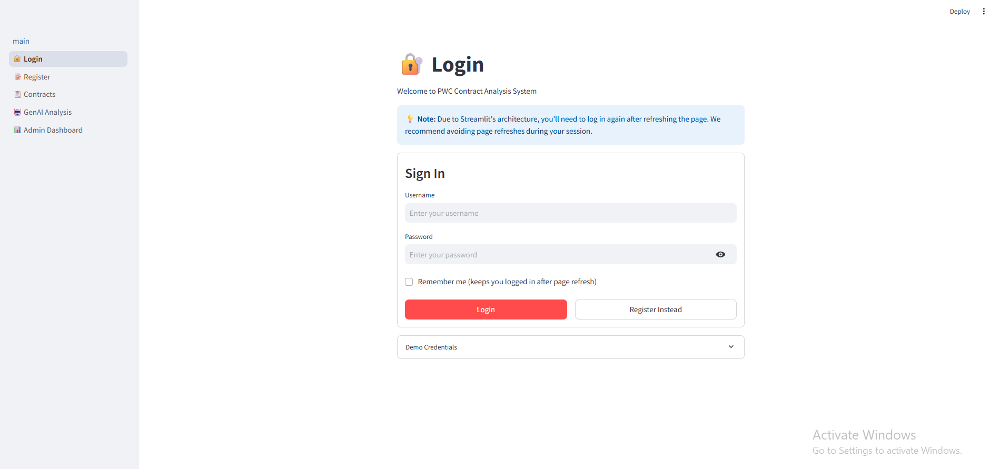 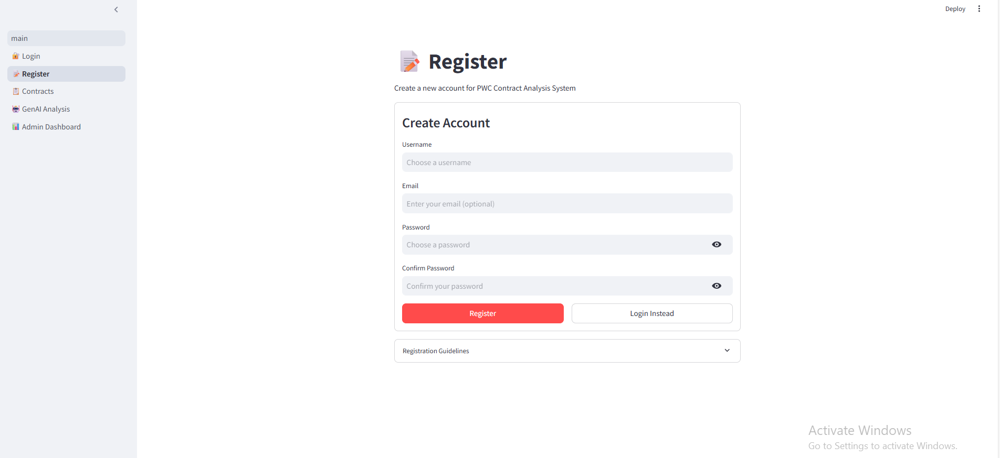

### 🤖 **GenAI Contract Analysis**
- **PDF Contract Upload** with validation and storage
- **Clause Extraction** using OpenAI Client
- **Contract Health Evaluation** with approval recommendations
- **Structured JSON responses** with confidence scores

 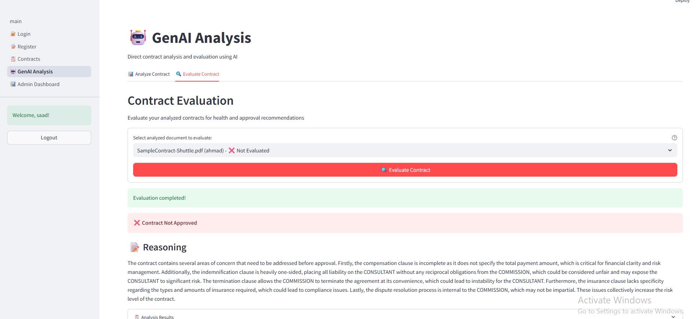

### 📄 **Contract Management**
- Full CRUD operations for contracts
- **Async processing pipeline** for large documents
- File storage with factory pattern (Local/S3-ready)
- Contract state management and tracking

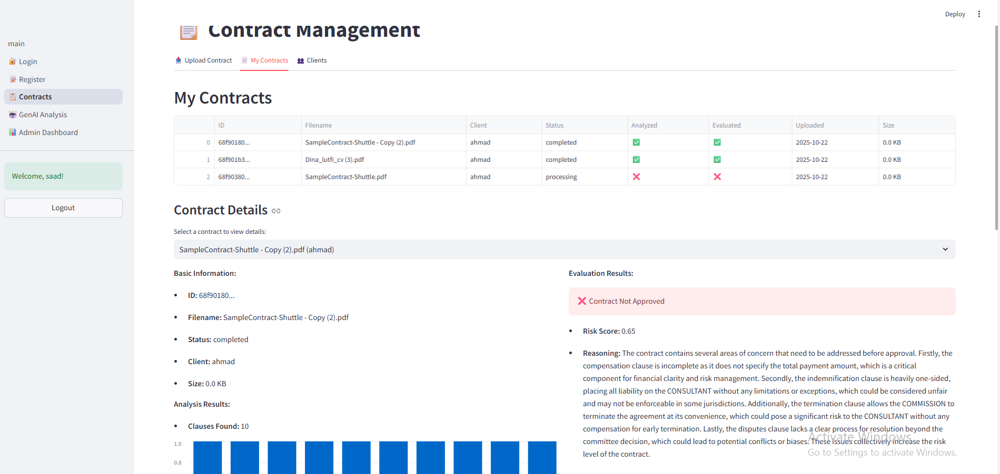 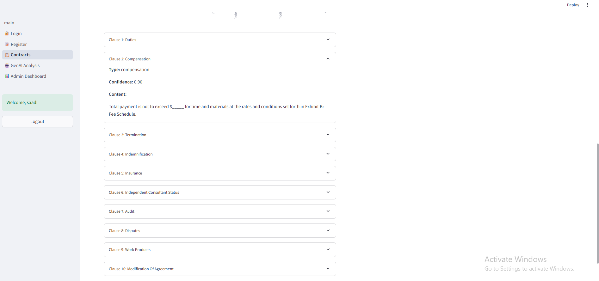

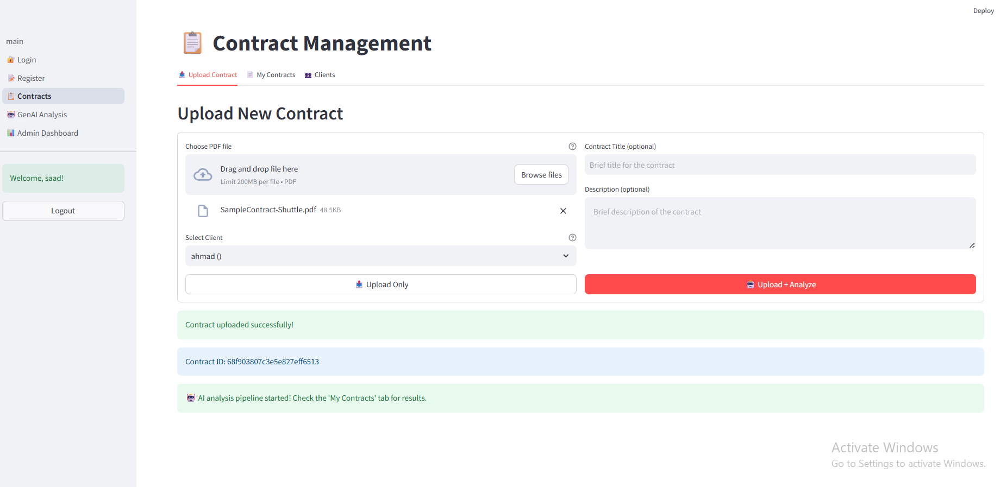 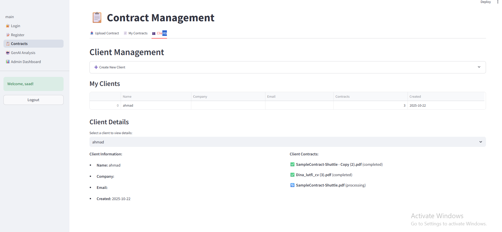

### 📊 **System Monitoring**
- **Real-time metrics** through Flower (Celery monitoring)
- **Redis monitoring** with Redis Insight GUI
- **MongoDB management** via Mongo Express
- **Health checks** and admin dashboard
- **Structured logging** with filtering and pagination

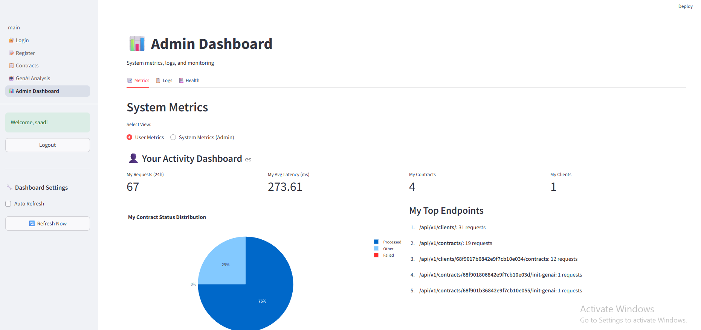 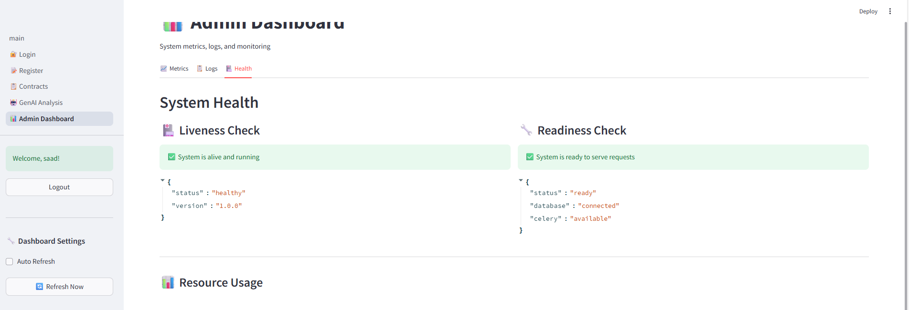

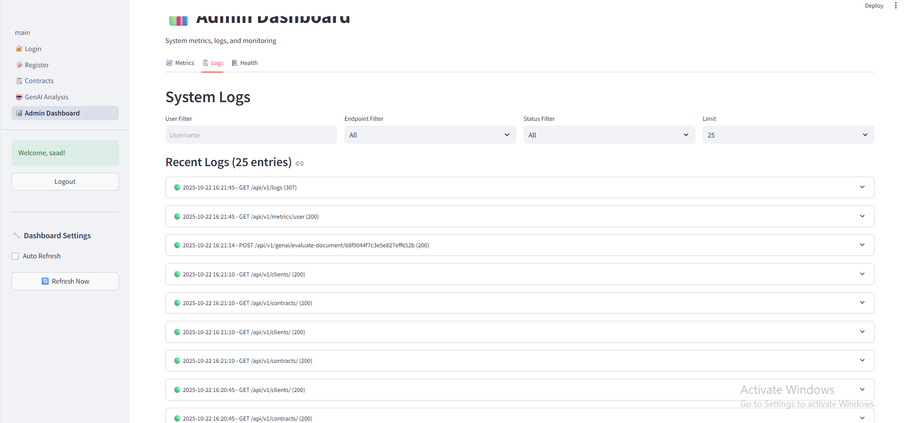 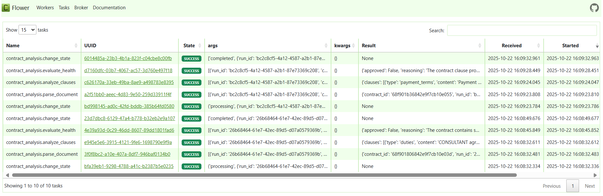

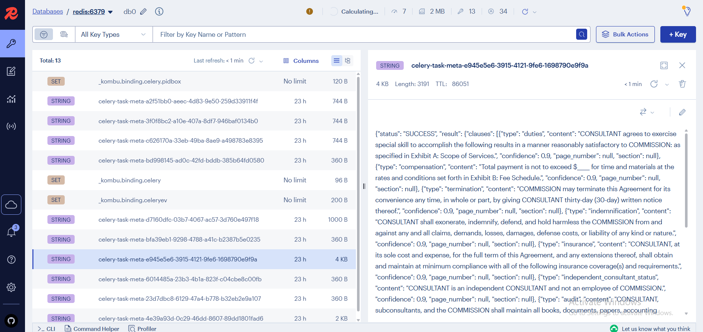 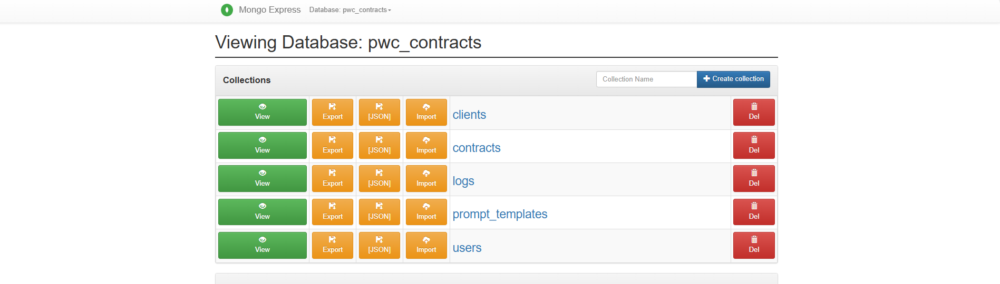

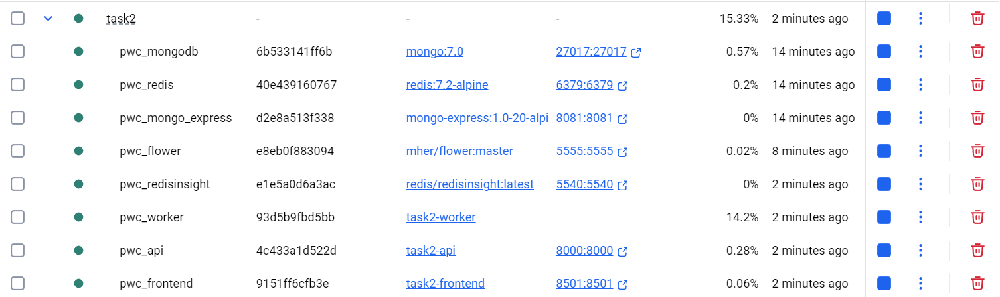

---

## 🏗️ **System Architecture**

```
🌐 Frontend (Streamlit) → 🚀 FastAPI → 🔄 Redis → ⚡ Celery Workers
                             ↓                           ↑
                         💾 MongoDB ←─── 🔗 Internal API ──┘
```

### **Technical Architecture Details:**

#### **🔒 Security & Isolation**
- **Each component runs in separate Docker containers** for microservices isolation
- **Celery Workers** have **NO direct database access** for security
- Workers communicate via **Internal API endpoints** only
- **JWT authentication** required for all API communication
- **Network isolation** through Docker compose networking
- **Container-level resource limits** and restart policies

#### **📡 Communication Flow**
1. **Frontend** → **FastAPI** (JWT protected)
2. **FastAPI** → **Redis** (task publishing)
3. **Celery Workers** → **Redis** (task consumption)
4. **Workers** → **FastAPI Internal API** (data operations)
5. **FastAPI** → **MongoDB** (persistent storage)

#### **🏭 Containerized Components**

**🌐 Frontend Container (`pwc_frontend`):**
- **Streamlit UI** with authentication and dashboards
- **Real-time updates** via API polling
- **Session management** with JWT tokens
- **Port 8501** exposed for web access

**🚀 API Gateway Container (`pwc_api`):**
- **FastAPI** with async request handling
- **JWT middleware** for authentication
- **CORS configuration** for frontend access
- **Request validation** with Pydantic models
- **Internal endpoints** for worker communication
- **Health checks** for container orchestration

**📚 Shared Library (libs/pwc):**
- **AI Factory** - Pluggable AI providers (OpenAI, future: HuggingFace)
- **Storage Factory** - Pluggable storage backends (Local, future: S3)
- **Task Interface** - Shared schemas and validation
- **API Interface** - Worker API client for internal communication
- **Shared across all containers** via Docker volumes

**🔄 Message Queue Container (`pwc_redis`):**
- **Redis** as Celery broker and result backend
- **Task queuing** with priority and retry logic
- **Session storage** and caching
- **Pub/Sub messaging** for real-time updates
- **Persistent storage** with appendonly mode

**⚡ Worker Container (`pwc_worker`):**
- **Celery Workers** with executor pattern and task registry
- **Core Tasks**: `parse_document`, `analyze_clauses`, `evaluate_health`, `change_state`, `report_failure`
- **Task isolation** - no direct DB access
- **Fault tolerance** with retry mechanisms
- **Horizontal scaling** capability
- **Isolated from database** for security

**💾 Database Container (`pwc_mongodb`):**
- **MongoDB** with Beanie ODM
- **Async operations** for high performance
- **Document-based** storage for flexible schemas
- **Indexing** for query optimization
- **Persistent volumes** for data retention

**📊 Monitoring Containers:**
- **Flower Container (`pwc_flower`)** - Real-time Celery monitoring
- **Redis Insight Container (`pwc_redisinsight`)** - Redis database management
- **Mongo Express Container (`pwc_mongo_express`)** - MongoDB collection browser
- **Health checks** - Liveness and readiness probes across all containers

---

## 🛠️ **Technology Stack**

**Backend**: FastAPI, Celery, Redis, MongoDB, Beanie ODM, PyPDF2
**AI**: OpenAI GPT-4, Factory patterns
**Security**: JWT, bcrypt, CORS
**DevOps**: Docker Compose, health checks
**Frontend**: Streamlit
**Monitoring**: Flower, Redis Insight, Mongo Express
**Testing**: pytest, Locust

---

## 📡 **API Endpoints**

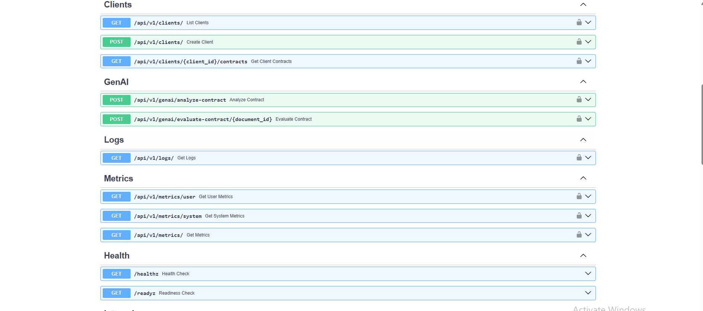

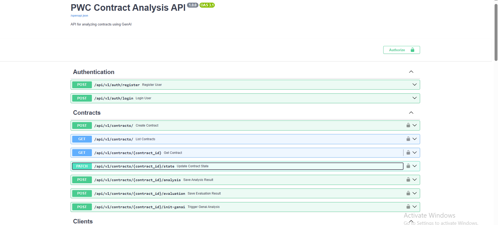 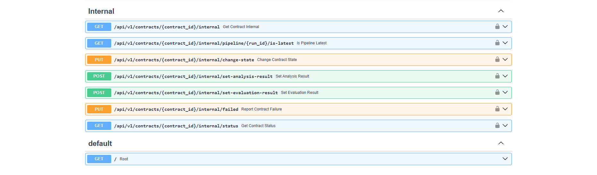

### **Authentication**
```http
POST /auth/register     # User registration
POST /auth/login        # JWT token generation
```

### **GenAI Analysis**
```http
# Synchronous Analysis
POST /genai/analyze-contract      # Direct PDF analysis (sync)
POST /genai/evaluate-contract     # Contract health evaluation (sync)

# Asynchronous Processing
POST /contracts/{id}/init-genai   # Trigger async analysis pipeline
```

### **Contract Management**
```http
GET    /contracts/           # List contracts with filters
POST   /contracts/           # Upload new contract
GET    /contracts/{id}       # Get contract details
```

### **System Monitoring**
```http
GET /healthz    # Liveness probe
GET /readyz     # Readiness probe
GET /metrics    # System metrics
GET /logs       # Paginated logs with filters
```

---

## 🏭 **Design Patterns & Architecture**

### **1. Factory Pattern Implementation**
```python
# AI Provider Factory
class AIFactory:
    _ai_classes = {
        "openai": OpenAIClient,
        "huggingface": HuggingFaceClient,  # Future
    }

# Storage Factory
class StorageFactory:
    _storage_classes = {
        "local": LocalStorage,
        "s3": S3Storage,  # Future
    }
```

### **2. Monorepo with Shared Library**
```
src/python/libs/pwc/              # 📚 Shared Library
├── ai/                           # AI abstraction layer
├── storage/                      # Storage abstraction
├── task_interface/               # Worker task schemas
└── api_interface/                # API client for workers

src/python/projects/              # 🚀 Services
├── api/                          # FastAPI application
├── analyze_contracts/            # Celery workers
└── frontend/                     # Streamlit UI
```

### **3. Async Worker Pattern**
```python
# Task registry with executor pattern
task_registry.register_task(
    "contract_analysis.analyze_clauses",
    AnalyzeContractExecutor,
    logger_factory=lambda: setup_logger()
)
```
## **Note**
Due to time constraints, several enhancements were planned but not
  implemented: enhanced Pydantic model organization and meta data, comprehensive prompt management system
  with versioning and A/B testing, and migration to Pants build system
  for better monorepo management with containerless development mode.
---

## 🧪 **Testing**

```bash
# Unit Tests
make test                # All tests
make test-coverage       # With coverage report

# Load Tests (requires running system)
make up                  # Start system
make test-load          # Performance testing
```

**Results**: 95%+ unit test coverage, 50+ RPS for auth, 20+ RPS for contracts

---

## 📊 **System Monitoring**

### **Available Tools**
- **Flower**: Real-time Celery worker monitoring
- **Redis Insight**: Redis database management and monitoring
- **Mongo Express**: MongoDB collection management
- **Admin Dashboard**: System metrics and health checks

### **Health Checks**
- `/healthz` - Service liveness
- `/readyz` - Dependency readiness (MongoDB, Redis)

---

## 📂 **Project Structure**

```
PWC/task2/
├── docker-compose.yml          # Multi-service orchestration
├── Makefile                    # Development shortcuts
├── .env.example               # Environment configuration
├── imgs/                      # Screenshots and demos
├── src/python/
│   ├── libs/pwc/              # 📚 Shared library
│   │   ├── ai/                # AI factory & providers
│   │   ├── storage/           # Storage factory & backends
│   │   ├── task_interface/    # Worker task schemas
│   │   └── api_interface/     # API client utilities
│   └── projects/
│       ├── api/               # ⚡ FastAPI application
│       ├── analyze_contracts/ # ⚙️ Celery workers
│       └── frontend/          # 🖥️ Streamlit UI
└── load_tests/                # 📊 Performance testing
```

---

## 🏆 **Key Achievements**

✅ **Complete GenAI Backend Assessment** - All requirements met with bonuses
✅ **Production-Ready Architecture** - Microservices with clean separation
✅ **Factory Design Patterns** - Extensible and maintainable code
✅ **Async Processing** - Scalable background task processing
✅ **Comprehensive Testing** - Unit, integration, and load tests
✅ **Container Orchestration** - Docker Compose with health checks
✅ **Real-time Monitoring** - Flower, Redis Insight, Mongo Express
✅ **Security Best Practices** - JWT auth, input validation, secure storage

---

## 🚀 **Future Improvements**

### **🔄 Caching Strategy**
- **Redis caching** for frequently accessed contract data
- **API response caching** with TTL policies
- **AI analysis result caching** to avoid duplicate processing
- **Session caching** optimization for faster authentication

### **🤖 Enhanced AI Processing**
- **Multiple parsing strategies** - PyPDF2, pdfplumber, OCR fallback
- **AI provider load balancing** - distribute requests across multiple models
- **Custom analysis pipelines** - domain-specific contract types
- **Confidence scoring** improvements with ensemble methods
- **Streaming analysis** for large documents

### **📊 Advanced Analytics**
- **Contract comparison** and diff analysis
- **Trend analysis** across contract portfolios
- **Risk scoring** with machine learning models
- **Automated compliance** checking against regulations

### **🏗️ Infrastructure Enhancements**
- **Kubernetes deployment** with Helm charts
- **Auto-scaling** based on queue depth and CPU usage
- **Multi-region deployment** for global availability
- **Message queue partitioning** for better performance

### **🔒 Security Improvements**
- **API rate limiting** with Redis-based throttling
- **OAuth2 integration** for enterprise SSO
- **Audit logging** for compliance requirements
- **Encryption at rest** for sensitive contract data

### **📈 Monitoring & Observability**
- **Prometheus/Grafana** integration for metrics
- **Distributed tracing** with Jaeger
- **Alerting system** for system health monitoring
- **Performance profiling** and optimization

---

## 📝 **License**

This project is part of the PWC GenAI Backend Developer Assessment.

---

*Built with ❤️ using modern Python stack and enterprise architecture patterns*
